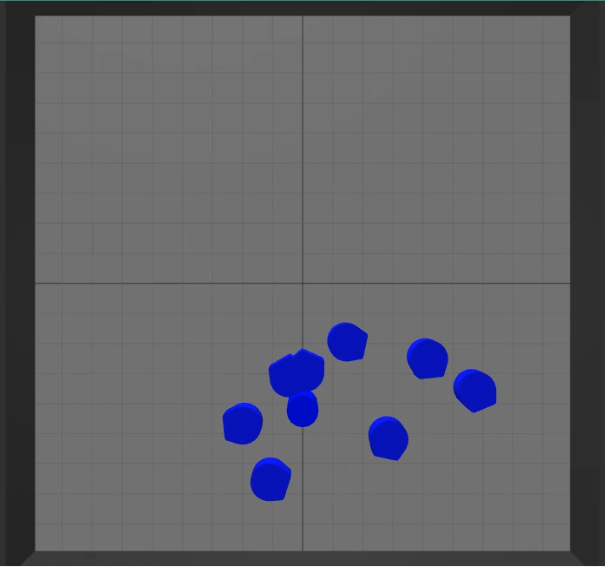

[comment]: # "This is the standard layout for the project, but you can clean this and use your own template"

# Programming and Compiler Toolchain for Swarm Robots

#### Team

- E/17/352, Tillekeratne L.J.I., [email](mailto:e17352@eng.pdn.ac.lk)
- E/17/398, Wijerathne I.D.H.S.D., [email](mailto:e17398@eng.pdn.ac.lk)
- E/17/159, Kavinaya Y., [email](mailto:e17159@eng.pdn.ac.lk)

#### Supervisors

- Dr. Isuru Nawinne, [email](mailto:isurunawinne@eng.pdn.ac.lk)
- Dr. Mahanama Wickramasinghe, [email](mailto:mahanamaw@eng.pdn.ac.lk)
- Prof. Roshan Ragel, [email](mailto:roshanr@eng.pdn.ac.lk)

#### Table of content

1. [Abstract](#abstract)
2. [Related works](#related-works)
3. [Methodology](#methodology)
4. [Experiment Setup and Implementation](#experiment-setup-and-implementation)
5. [Results and Analysis](#results-and-analysis)
6. [Conclusion](#conclusion)
7. [Publications](#publications)
8. [Links](#links)

---

## Abstract

This research aims to create an Integrated Development Environment (IDE) for swarm robots, compatible with virtual and physical platforms. The IDE's key features include a graphical, block-based interface for high-level algorithm composition, facilitating the programming of complex swarm behaviors. It supports bottom-up design, allowing users to experiment with built-in behaviors and program new ones. Specialized support includes random movement, obstacle avoidance, task allocation, and object finding. The IDE automates the conversion of graphical algorithms to C++ and Java, enabling compilation and execution on both virtual and physical swarm robot platforms which are created in the [PeraSwarm](https://pera-swarm.ce.pdn.ac.lk/) project. The user-friendly IDE streamlines the programming, compilation, and execution of diverse swarm behaviors, validated through multiple experiments.

## Related Works

We conducted the literature review based on two main categories: swarm programming tools-based studies and swarm behavioural algorithms-based studies. 

#### Swarm Programming Tools-based Studies

* **Swarm-Bench**: It is a benchmarking framework for assessing swarm intelligence algorithms, offering standardized problems and metrics for fair evaluations. It prioritizes benchmarking over algorithm implementation, necessitating additional programming for custom algorithms.

* **SwarmOps**: SwarmOps is a Python library for swarm intelligence optimization, featuring algorithms like PSO and DE. It emphasizes flexibility, customization, and experimentation.

* **PySwarm**: PySwarm is a Python library specializing in PSO algorithms, offering a simple interface for experimentation with customization options. It is less comprehensive than some other libraries and, like SwarmOps, is specific to swarm intelligence optimization algorithms.
  
* **SwarmLib**: SwarmLib is a Java library for swarm intelligence algorithms, encompassing techniques like PSO, ACO, and ABC. It caters to researchers and developers, but, being a presentation tool, is limited to pre-programmed swarm behaviors and lacks support for real robot systems.

* **Physicomimetics**: Physicomimetics, in implementing swarm behaviors, employs a virtual physics framework to simulate collective dynamics observed in natural swarms. Combining physics and biology principles, it replicates emergent properties and behaviors. The framework, limited to predefined rules, simulates specific behaviors but may lack adaptability to dynamic real-world swarm conditions.
  
* **Buzz**: Buzz is a Domain-specific language (DSL) and simulation framework for swarm robotics, offering high-level language and a simulator for algorithm testing. It's hardware-independent with top-down primitives like Swarm, Neighbours, and Virtual Stigmergy, addressing hardware dependency with the BuzzVM virtual machine. While it supports coordination and communication for complex collective behaviors, it has a steep learning curve due to the DSL aspect.

* **Actor-based programming framework**: The Actor-based programming framework, adopting a bottom-up design, simplifies swarm behavior programming by providing common functionalities and a high-level abstraction called "Actor." This abstraction manages collective behaviors, representing different groups. The framework also uses a domain-specific language (DSL) for programming Actor-based tasks, implemented in C++. Although lacking visual programming, it aligns with the goal of enabling developers to focus on complex swarm behaviors without dealing with low-level complexities.

* **iRobot**: iRobot engages in swarm robotics research, emphasizing coordination among large robot groups using a decentralized, bottom-up approach. This involves individual agents interacting locally based on simple rules, without centralized control. Applied in domains like search and rescue and environmental monitoring, this strategy enhances efficiency and effectiveness in task accomplishment.

#### Swarm Behavioural Algorithms-based Studies

Some of the swarm behaviours that we encountered during our literature review are listed below. Under each behaviour, several studies were analysed.

* **Flocking**: Flocking behavior mimics the movement of natural flocks, such as birds or schools of fish. It involves agents aligning their velocities, maintaining cohesion, and avoiding collisions. The result is a cohesive and coordinated movement of the entire swarm.

* **Pattern formation**: Pattern formation refers to the ability of a swarm to self-organize into specific shapes or arrangements. This behavior involves agents adjusting their positions relative to each other to create predefined patterns, which can be useful in tasks like environmental monitoring or area coverage.

* **Object searching**: In object searching behavior, the swarm of robots collaboratively explores an environment to locate specific objects. This may involve systematic exploration strategies or communication among agents to efficiently cover the search space and share information about discovered objects.
  
* **Repulsion-Attraction for foraging**: In foraging behavior, robots search for and collect resources distributed in the environment. Repulsion-attraction mechanisms involve agents being repelled by obstacles or other agents while being attracted to resources. This dual mechanism helps in navigating around obstacles and efficiently locating and collecting resources.

* **Dynamic task allocation**: Dynamic task allocation involves the real-time assignment of tasks to individual robots based on changing environmental conditions or task requirements. This behavior allows the swarm to adapt to dynamic situations, redistributing tasks among robots to optimize overall performance and achieve efficient task completion.

#### Problems identified

* Complexity in programming swarm robots to achieve a collective behaviour
* No support for block-based visual programming in the existing tools
* Limited to software-level simulations rather than comprehensive development libraries
* Lack of support for both physical and virtual robots
* Limited to a few pre-programmed sets of behaviours & bias towards specific algorithms

## Methodology

The following sections detail the essential steps and strategies integral to the development process.

#### System Architecture

    

The above figure shows the main components of the software system architecture. The IDE includes a React Frontend with a NodeJs backend established in a docker container as a HTTP central server. The backend is integrated with two compilers; PlatformIO and Maven. The IDE is compatible with the two Virtual and Physical Swarm Robot platforms, as shown in the diagram. The physical robot runs C++ binaries and is equipped with key components for sensing and communication. It features front-facing distance and color sensors, a Neopixel LED, and four infrared sensors for interactive signaling. Additionally, the robot is enhanced with a WiFi module for improved connectivity. The Peraswarm Virtual robot platform includes a Java virtual robot, Node.js simulator, and a visualizer. The simulator allows for distance and color readings, robot color changes, and arena configuration. 

#### High-level Algorithm Composition

The primary goal is to simplify high-level algorithm composition for users, especially in swarm behavior research. Emphasizing the educational sector, the system employs a user-friendly interface with a block-based visual programming technique. Integrated with Google Blockly in the React frontend, users intuitively design complex swarm behaviors by dragging and dropping blocks. The design includes diverse block types such as Behavioural blocks, IO blocks for functionalities like sensor readings and actuator activation, and General blocks for programming elements like loops, conditions, and variables. The hierarchical approach categorizes behaviors into atomic, pair, cluster, and global levels, enabling users to smoothly combine low-level behaviors for complex collective swarm behaviors. This ensures consistency between physical and virtual platforms, maintaining uniformity in behavior execution. The below figures shows the block structure and the level-based behaviour structure that we have introduced facillitating the bottom-up design approach.

|     Behaviour Structure                      |    Block Structure                        |
| ----------------------------------- | ----------------------------------- |
|   |  |

#### Dynamic Code Generation and Compilation

The IDE transforms graphical-level algorithms from block-based visual programming into C++ and Java code using the Google Blockly library. The backend, utilizing PlatformIO CLI and Maven, supports remote cross-compilation, compiling code, generating binaries for the physical platform, and jar files for the virtual platform. This approach ensures flexibility in deployment strategies across diverse platforms. Additionally, the IDE enables version control for compiled binaries and class files, ensuring the availability of the latest versions for efficient deployment across the robot swarm through HTTP requests.

#### Over-the-Air (OTA) Code Upload and Execution

The system employs WiFi modules and a central server to achieve over-the-air downloading of executables to both virtual and physical swarm robots. Using MQTT, the central server signals robots to initiate downloads, ensuring seamless transitions for new code. The central server monitors the process, guaranteeing correct installations. This approach enables efficient updates without physical connections or manual interventions.

#### Enhancement of IDE Capabilities

The IDE is upgraded with features for programming behaviors, visualizing the virtual arena, and generating executables for multiple robots. It includes a repository of pre-developed algorithms, and strengthened MQTT connectivity ensures efficient communication between the IDE and robot platforms, empowering users in creating, testing, and refining swarm behaviors. A series of experiments are conducted to validate the IDE's functionality in various scenarios, from foundational setup to feature enrichment, ensuring its effectiveness and efficiency in creating complex swarm behaviors. Some of the demonstrations of the features of the IDE are given below.

 

## Experiment Setup and Implementation

#### Dynamic Task Allocation Behaviour

 

Multiple experiments were conducted using the IDE on virtual and physical robot platforms, focusing on dynamic task allocation and object finding. The summary of all the behaviours tested are in the above diagram. The dynamic task allocation behavior, inspired by previous research, involves assigning robots to tasks based on the colors of objects in the environment. Robots use a decentralized approach, maintaining local task demand and supply queues, estimating global task demand and supply, and updating response threshold values to achieve the desired task distribution. The algorithm demonstrates decentralization, adaptability to changing environmental conditions, and the emergence of specialization among robots over time. The experiments validate the effectiveness of this complex swarm behavior. The flow of the behaviour is demonstrated below.

  

* **The Experimentation Process using the IDE**

The dynamic task allocation behavior is programmed using the block-based visual interface, offering different approaches. Users can code the algorithm from scratch, use the built-in behavior option, or utilize the level-based set of blocks designed for this behavior. Behavioural blocks such as random movement with obstacle avoidance, observe environment, evaluate task demand, evaluate task supply, select task and show task were designed to be used in this behaviour. In the experiment, the third approach was chosen. After programming, Java codes were generated and reviewed for execution in the virtual robot platform. The simulation environment was set, robots were placed, and the code was compiled and executed. The successful results validate the IDE's programming, compilation, and execution process.

#### Object Finding Behaviour

In the experiment, the virtual robot utilized object detection with obstacle avoidance to find a specific-colored object. The algorithm includes color-based detection, dynamic response to object detection, adjustment for object distance and angle, and visualization of the detection state. Physical robots integrate color and distance sensors for forward path object detection. The algorithm involves distance reading, obstacle detection, color-based decision, correction for non-target color, visualization, and further movement. The robots adaptively respond to detected objects, adjusting their position and color visualization based on the object's characteristics and proximity.

* **Contrasting Object Finding Behaviour in Virtual Robot and Physical Robot**

 

https://github.com/cepdnaclk/e17-4yp-develop-a-programming-and-compiler-toolchain-for-multi-agent-systems/assets/73964613/dfe83613-1a0e-46b0-85f6-2d42d761244d

The object-finding behaviors of virtual and physical robots share the common goal of discovering objects based on predefined colors. However, their implementations differ significantly. The virtual robot adapts its movement based on simulated sensor inputs, equipped with virtual proximity sensors at multiple angles. In contrast, the physical robot, reliant on front-facing color and distance sensors, can only perceive one direction. The adaptability of the virtual robot is constrained by simulated conditions, while the physical robot encounters real-world challenges, like rotating to identify unobstructed directions.

## Results and Analysis

* **Qualitative Performance Analysis of the developed IDE**

The qualitative performance analysis of the developed IDE focuses on three main aspects: the usability of the graphical programming interface, flexibility, and re-programmability of swarm behaviors, and compatibility with both physical and virtual robot platforms.

**Usability of the Graphical Programming Interface**: 
  * The IDE introduces a user-friendly block-based interface, enhancing programming usability.
  * Its code-less approach is beginner-friendly, making it accessible for users with no prior programming knowledge.
  * Mitigates the learning curve associated with traditional programming frameworks, promoting quicker adoption and proficiency.
    
**Flexibility and Re-programmability of Behaviors**:
  * The IDE allows flexibility in programming swarm behaviors, offering multiple options.
  * Users can create new behaviors from scratch, experiment with built-in behaviors, or use provided behavior-specific blocks.
  * Modular and scalable graphical blocks enable seamless experimentation and re-programming without limitations.
    
**Compatibility with Both Physical and Virtual Robot Platforms**:
  * The IDE surpasses conventional limitations by supporting both physical and virtual swarm robot platforms.
  * Users can easily execute and observe programmed behaviors in both environments with a few clicks.
  * Facilitates a smooth transition between simulated environments and real-world implementations, ensuring unified development and testing.

* **Results of the Dynamic Task Allocation Behaviour**

  **Testing of convergence to the desired distribution**: Multiple tests were conducted to evaluate the dynamic task allocation behavior, focusing on the main characteristic of converging to the desired task distribution. The robot arena dimensions were set at 70×70 units², with ten colored objects randomly placed. Two scenarios were tested, varying task proportions (20% red, 80% blue in the first and 60% red, 40% blue in the second). Results, depicted in below Figures, consistently show robots converging to and stabilizing in the intended task distributions, supporting the conclusion that the dynamic task allocation behavior executes as intended. The tests affirm the successful programming, compilation, and execution process of the IDE.

 
  
  **Testing task specialisation of the robots**: The analysis involves monitoring threshold value changes over time, revealing strong specialization in certain robots for specific tasks. A high threshold for task red and a low one for task blue imply strong specialization in task blue. This mirrors the division of labor seen in natural swarms. Results (Figures 8 and 9) in a 90×90 units² arena with ten robots initially assigned to task red and a 40% red, 60% blue proportion show substantial threshold changes in robots 0, 4, and 7. Their final thresholds indicate strong specialization in task blue, aligning with the observed behavior in natural swarms.

 
  
* **Results of the Object Finding Behaviour**

In the virtual robot experiment, eight robots successfully identified and localized a blue object using dynamic navigation, object detection, and obstacle avoidance. Before and after states are presented in the below figure. The physical robot experiment, with five robots designated as blue targets, achieved the collective goal but encountered an issue where robots occasionally formed a chain instead of converging near the target. Addressing this challenge is a priority for refining the algorithm's optimization in future iterations to enhance performance in real-world scenarios.

 
  
## Conclusion

https://github.com/cepdnaclk/e17-4yp-develop-a-programming-and-compiler-toolchain-for-multi-agent-systems/assets/73964613/d4b4b439-6091-456e-9b80-459e4db0cc55

The study introduces a framework for swarm behavior development, emphasizing a unified environment integrating block-based visual programming and a user-friendly IDE for both virtual and physical platforms. The IDE enhances user experience with features like visual programming, code generation, compilation, and OTA code upload. Experiments with decentralized dynamic task allocation and object-finding behaviors demonstrate swarm convergence and adaptability. Inspired by natural swarms, the decentralized task allocation mimics division of labor, while object-finding algorithms perform successfully in both simulated and real-world settings. Multiple experiments affirm the accuracy and reliability of the IDE's programming, compiling, and execution processes. The developed IDE can be identified as a useful tool for the educational and research sectors in the context of programming complex swarm behaviours.

## Publications
[//]: # "Note: Uncomment each once you uploaded the files to the repository"

1. [Semester 7 report](documentation/FYP_Proposal_Presentation_G07.pptx)
2. [Semester 7 slides](documentation/group07.pdf)
3. [Semester 8 report](documentation/G07_FYP_End_Evaluation_Presentation.pdf)
4. [Semester 8 slides](./)
<!-- 5. Author 1, Author 2 and Author 3 "Research paper title" (2021). [PDF](./). -->

## Links

[//]: # ( NOTE: EDIT THIS LINKS WITH YOUR REPO DETAILS )

- [Project Repository](https://github.com/cepdnaclk/e17-4yp-develop-a-programming-and-compiler-toolchain-for-multi-agent-systems)
- [Project Page](https://cepdnaclk.github.io/e17-4yp-develop-a-programming-and-compiler-toolchain-for-multi-agent-systems)
- [Department of Computer Engineering](http://www.ce.pdn.ac.lk/)
- [University of Peradeniya](https://eng.pdn.ac.lk/)

[//]: # "Please refer this to learn more about Markdown syntax"
[//]: # "https://github.com/adam-p/markdown-here/wiki/Markdown-Cheatsheet"
